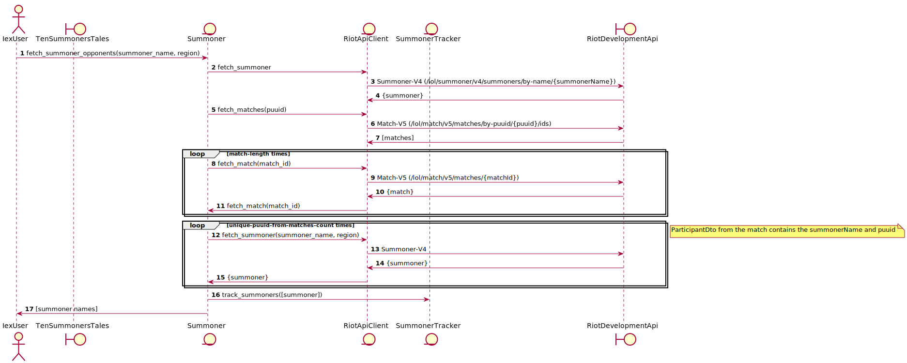

# TenSummonersTales

Implementation to track Summoner's game play using the Riot Developer API.

## High level logic flow



## Tests

```bash
mix test
```

Note that the tests are far from comprehensive at this point. 

## Run

```bash
git clone git@github.com:ciroque/ten_summoners_tales.git

cd ten_summoners_tales

export RIOT_API_KEY=<your key here>

mix deps.get

iex -S mix

iex(1)> TenSummonersTales.fetch_and_track_associated_summoners_for("ciroque", "qwerty")
iex(1)> TenSummonersTales.fetch_and_track_associated_summoners_for("ciroque", "na1")
iex(1)> TenSummonersTales.fetch_and_track_associated_summoners_for("boycold", "na1")
```

## TODO
- More testing, especially around error conditions
- Possibly? `defstruct Summoner { name: String.t(), puuid: String.t() }`
- Throttling to avoid hitting rate limits, though with a real key this _should_ be okay. To fix it, though, implement 
  batching and / or backoff logic to allow the threshold to reset.
- `TenSummonersTales.SummonerTracker.retrieve_new_matches` should be in a separate, well-tested, module.
- Handle 403 from Riot API
- Complete documentation
