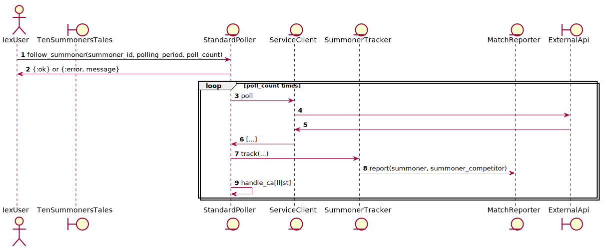

# TenSummonersTales

Implementation to track Summoner's game play in the [TODO] API.

## High level logic flow



## Running

```bash
iex -S mix

iex(1)> TenSummonersTales.Poller.fetch_summoners_opponents("ciroque", 500)
```
