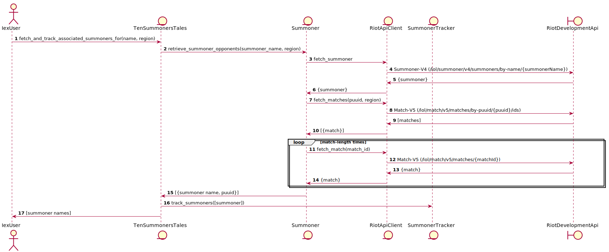

# TenSummonersTales

Implementation to track Summoner's game play using the Riot Developer API.

## High level logic flow



## Running

```bash
iex -S mix

iex(1)> TenSummonersTales.track_summoner("ciroque", "na1")
```
